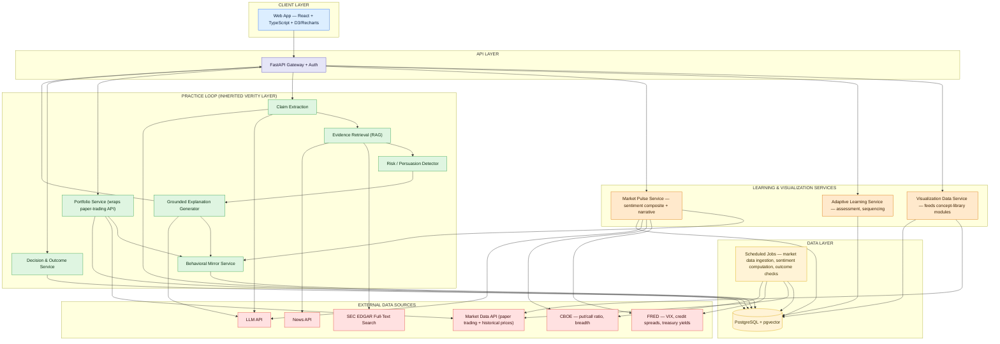
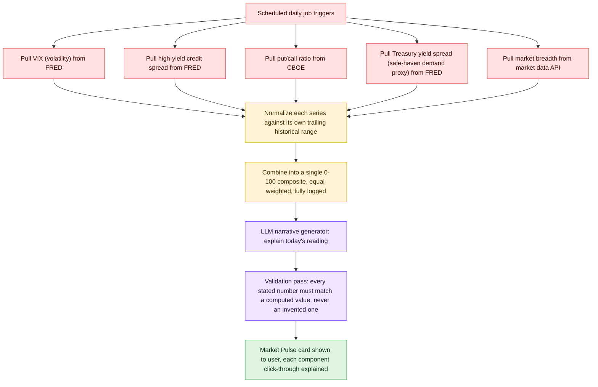
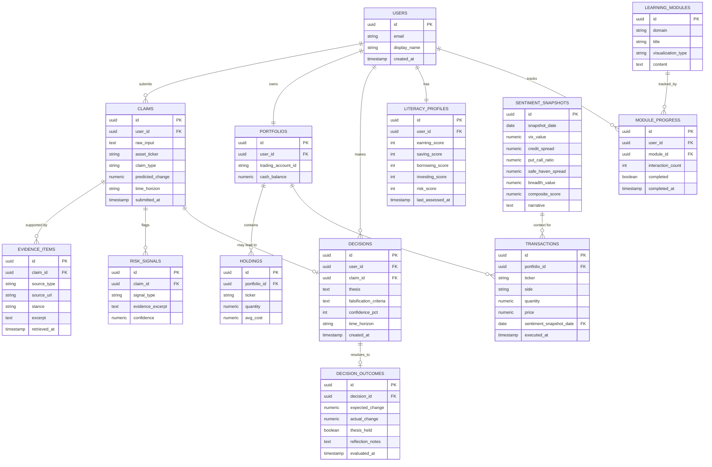
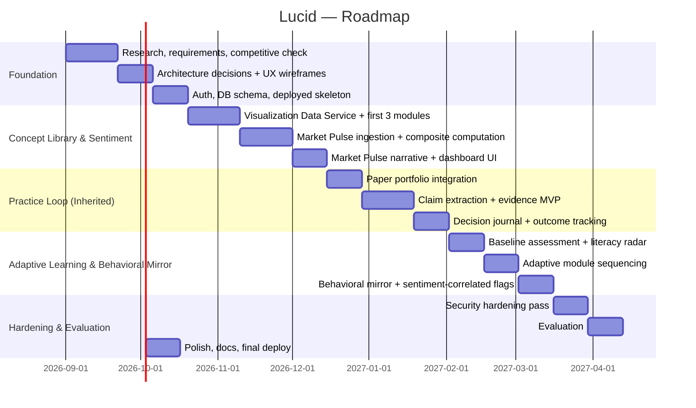

# Lucid — System Design Document

Companion to `README.md`. This is the master technical reference: architecture, data model, API surface, security model, tech stack, team ownership, roadmap, and evaluation plan.

---

## Table of Contents

1. [System Overview](#1-system-overview)
2. [Research Grounding](#2-research-grounding)
3. [Product Scope — In, Deferred, Cut](#3-product-scope--in-deferred-cut)
4. [Personas](#4-personas)
5. [Visualization & Literacy Framework](#5-visualization--literacy-framework)
6. [Architecture Overview](#6-architecture-overview)
7. [Component Breakdown](#7-component-breakdown)
8. [Market Pulse Pipeline](#8-market-pulse-pipeline)
9. [The Practice Loop (Inherited Verity Layer)](#9-the-practice-loop-inherited-verity-layer)
10. [Data Model](#10-data-model)
11. [API Surface](#11-api-surface)
12. [AI / Narrative Generation Architecture & Guardrails](#12-ai--narrative-generation-architecture--guardrails)
13. [Tech Stack & Justification](#13-tech-stack--justification)
14. [Security, Ethics & Compliance](#14-security-ethics--compliance)
15. [Team Structure](#15-team-structure)
16. [Roadmap](#16-roadmap)
17. [Evaluation Plan](#17-evaluation-plan)
18. [Risks & Mitigations](#18-risks--mitigations)
19. [Definition of Done](#19-definition-of-done)
20. [Sources](#20-sources)

---

## 1. System Overview

**Core loop:** Learn a concept visually → Read today's market sentiment → See a real claim online → Check the evidence → Simulate the decision → Log the thesis → Track the outcome → See it reflected in your own patterns → repeat.

Every feature must serve this loop directly. Lucid is not a course platform bolted onto a trading simulator — the visual concept library, the sentiment dashboard, and the practice loop are three entry points into the *same* underlying data (the same historical prices, the same live sentiment readings, the same claims the user submits), not three separate products sharing a login page.

---

## 2. Research Grounding

Verified against current sources as of August–September 2026 (full citations in §20):

- **TIAA Institute–GFLEC 2026 P-Fin Index (10th year):** U.S. adults correctly answered only 47% of 28 financial-literacy questions on average — the lowest result in the index's history and a statistically significant decline from the prior year. The share of adults with "very low" financial literacy rose from 20% (2017) to 25% (2026). Gen Z scored 38% on average, the lowest of any generation. **Comprehending risk is the one functional area that stays low across every generation and does not meaningfully improve with age** — this is the single most important finding shaping this project's design, because it means risk intuition has to be *taught*, not assumed to develop naturally over time.
- **FINRA, "Social Media-Influenced Investing," December 2025** (also Verity's grounding): 45% of investors get financial advice from the internet, 24% from social media specifically; 61% of investors 18–34 have made a decision based on a social-media personality's recommendation.
- **Academic precedent — Du, Amor, Ma & Wünsche, "Data Visualization for Improving Financial Literacy: A Systematic Review" (2025/2026, arXiv:2506.20901):** a review of 37 papers confirming visualization measurably improves financial comprehension over text-only formats, and explicitly identifying that most of this research stays confined to classroom studies and single-concept demonstrations rather than integrated, ongoing-use products — the exact gap this project targets.
- **Competitive check:** single-concept calculators (compound-interest simulators) are real and genuinely visual but teach exactly one idea in isolation; bite-sized lesson apps are text/quiz-first; the closest competitor (Finelo-style guided investing apps) pairs lessons with a generic paper-trading simulator but has no live sentiment layer and no mechanism connecting a specific real-world claim to the practice loop; market-sentiment tools (CNN's Fear & Greed Index, VIX/put-call dashboards) are real, live, and useful but built for practitioners who already know what the underlying indicators mean.
- **Data-source precedent for an original sentiment composite:** the CBOE Volatility Index (VIX) and ICE BofA High-Yield Option-Adjusted Spread are both published as free, public FRED series; CBOE separately publishes historical put/call ratio data under its own terms of use. These are the same categories of input CNN's Fear & Greed Index is built from (market momentum, volatility, options positioning, safe-haven demand, junk-bond demand), which confirms a comparable composite is buildable from public data without reproducing a proprietary index.

---

## 3. Product Scope — In, Deferred, Cut

**In scope (MVP):**
- Interactive visual concept library: compound growth, risk vs. return, diversification, dollar-cost averaging vs. lump sum, inflation erosion, market cycles/drawdowns — each rendered against real historical data with learner-adjustable parameters
- A short adaptive baseline assessment, modeled on the P-Fin Index's functional categories (earning, saving, borrowing, investing, comprehending risk), used to sequence which modules a learner sees first
- Market Pulse dashboard: an original sentiment composite computed from public volatility, options-positioning, credit-spread, safe-haven-demand, and breadth data, refreshed daily, with a plain-language, cited narrative explaining *why* the reading is what it is
- Click-through explainers on every Market Pulse component, linking each raw indicator back to the concept library
- Full inherited Verity practice loop: claim submission, evidence retrieval, risk/persuasion detection, $100,000 paper portfolio via a free paper-trading API, decision journal, outcome tracking
- Behavioral mirror: a visualization overlaying the learner's own simulated trade timing against historical price and sentiment data, plus the existing rule-based pattern flags (concentration, buy-after-run-up, panic-sell-after-drawdown), now including a sentiment-correlated flag (e.g., "you tend to buy when the Market Pulse reading is in Extreme Greed")

**Deferred (clearly optional/showcase, not required for the core loop):**
- Browser-extension prototype for encountering a claim without leaving the source page (inherited from Verity's own Phase 2 scope)
- ML-based behavioral profiling beyond the rule-based flags above
- Source/creator historical-accuracy tracking, seeded with a small public demo set rather than live-tracked

**Cut entirely, not deferred — and why:**
- **A full course/curriculum structure with grades or certificates.** Turns the product into an instructional-design and assessment-validity problem, which is a different (and much larger) scope than building market intuition.
- **Reproducing or scraping a proprietary sentiment index (e.g., CNN's Fear & Greed Index) directly.** Both a terms-of-service risk and a black-box import the system couldn't explain; the composite is computed independently from public data with a documented, inspectable methodology instead (§8).
- **Real bank-account integration and live/real-money trading.** Same reasoning as Verity §3 — compliance burden and licensing exposure with no connection to the product's actual thesis.
- **A single "financial literacy score."** Replaced by the multi-dimensional radar in §5, for the same reason Verity replaced a single "truth score" with an explainable multi-factor framework: an unexplainable number that looks authoritative is a liability, not a feature.
- **Cross-user social features, leaderboards, or comparison.** Comparing users to each other reintroduces the exact social-proof and FOMO dynamics the product is designed to counteract.

---

## 4. Personas

**Amara, 19, freshman.** Has $500 saved from a summer job and no idea where to start. Opens Lucid after a friend mentions "the market is down." Needs to *see* what "down" means relative to history before anything else makes sense, and needs the sentiment dashboard to explain itself in plain language the first time she sees it.

**Devon, 27, three years into a career.** Technically literate (comfortable with spreadsheets and apps) but never formally learned investing. Has tried a robo-advisor and a trading app but always felt like he was "clicking buttons without understanding why." Wants the visual library to fill in the *why* behind decisions he's already made, and wants the behavioral mirror to tell him honestly whether his past trades followed a pattern he isn't aware of.

**Priya, 34, generally financially literate but risk-averse to the point of avoiding investing entirely.** Represents the P-Fin Index finding that risk comprehension stays weak regardless of age or general literacy. Needs the risk-vs-return visualization specifically, more than any lesson on the basics she already knows.

---

## 5. Visualization & Literacy Framework

Two design rules govern every module in the visual concept library and the Market Pulse dashboard, both adapted directly from Verity's evidence-framework philosophy of never presenting an unexplainable single number as ground truth:

**Rule 1 — every visualization must be built on real, retrievable data, not an illustrative toy example.** A compounding chart uses real historical index returns, not a flat assumed 7%. A risk-vs-return scatter plot uses real asset classes and their real historical volatility, not invented dots. This is what separates the concept library from a static infographic: the learner is manipulating a real dataset, not watching a canned animation.

**Rule 2 — literacy is reported as a multi-dimensional profile, never a single score.** The baseline assessment and ongoing progress are tracked across the same functional categories the P-Fin Index uses — earning, saving, borrowing, investing, comprehending risk — displayed as an explainable radar chart, not a single "your financial literacy is 62/100" number. Comprehending risk is never averaged away into a composite; it is always shown as its own dimension, because the research grounding in §2 shows it is the dimension least likely to improve on its own.

| Dimension (from P-Fin Index categories) | What it tracks in Lucid |
|---|---|
| Earning & income | Baseline assessment only — not a deep focus area for this product |
| Saving & spending | Connects to the compounding and inflation-erosion visualizations |
| Borrowing & debt | Baseline assessment only — flagged as a gap area, deferred to future scope |
| Investing | Connects to diversification, dollar-cost averaging, and the full practice loop |
| Comprehending risk | Connects to the risk-vs-return visualization and the Market Pulse dashboard directly — the primary focus area given the research grounding |

---

## 6. Architecture Overview

Modular monolith, consistent with Verity's architectural decision: one deployable backend, internally organized into clearly separated modules with clean interfaces. The Verity practice-loop modules (Portfolio, Decision & Outcome, Claim Extraction, Evidence Retrieval, Risk/Persuasion Detector) are incorporated largely unchanged; two new module groups are added — the Visualization Data Service and the Market Pulse Service — plus a new Adaptive Learning Service that sequences content across both the concept library and the practice loop.



**Color key:** blue = client, indigo = API/auth boundary, amber = new learning/visualization services, green = inherited practice-loop services, gold = data layer, red = external data sources.

---

## 7. Component Breakdown

| Component | Responsibility | Layer |
|---|---|---|
| Web App | Concept-library UI, Market Pulse dashboard, claim-investigation UI, decision journal, behavioral mirror | Frontend |
| FastAPI Gateway + Auth | Routing, JWT auth, rate limiting, request validation | API |
| Visualization Data Service | Serves real historical price/return series to the concept-library modules, pre-shaped for charting | Learning |
| Adaptive Learning Service | Runs the baseline assessment, stores the literacy radar, sequences which modules surface next | Learning |
| Market Pulse Service | Ingests volatility, credit-spread, options-positioning, and breadth data; computes the composite; generates the cited plain-language narrative | Learning |
| Claim Extraction | Structures a pasted claim: asset, prediction, time horizon, claim type | Practice (inherited) |
| Evidence Retrieval (RAG) | Pulls market data, filings, and news to build the evidence set for a claim | Practice (inherited) |
| Risk / Persuasion Detector | Rule + LLM detection of manipulation/urgency/FOMO language | Practice (inherited) |
| Grounded Explanation Generator | Turns retrieved evidence into a cited, factor-scored report | Practice (inherited) |
| Portfolio Service | Wraps paper-trading calls; holdings, transactions, P&L | Practice (inherited) |
| Decision & Outcome Service | Stores theses immutably; runs scheduled outcome-comparison jobs | Practice (inherited) |
| Behavioral Mirror Service | Correlates a learner's own decision history against price and sentiment data; renders the overlay visualization and pattern flags | Practice (extended) |
| Scheduled Jobs | Market/sentiment data ingestion, filings/news ingestion, outcome checks, cache refresh | Data / Infra |

---

## 8. Market Pulse Pipeline

The sentiment composite is deliberately **computed, not imported** — no proprietary index is scraped or reproduced. It is inspired by the same category of inputs CNN's Fear & Greed Index uses (momentum, volatility, options positioning, safe-haven demand, credit conditions), but every input is a public, freely available series with a documented source, and the combination method is fully inspectable by the learner.



The non-negotiable rule, identical in spirit to Verity's claim pipeline: the language model **narrates a number that was already computed deterministically**; it never estimates, guesses, or fills in a component value itself. If any upstream data source fails to return for the day, that component is marked unavailable in the composite and disclosed as such — the system never silently substitutes a stale or fabricated value.

---

## 9. The Practice Loop (Inherited Verity Layer)

Lucid incorporates Verity's claim-evidence-and-simulation loop as-is at the architectural level, with one addition: every output of the practice loop now also feeds the Behavioral Mirror Service, so a learner's real decisions become part of their own visual learning material.

- **Claim investigation:** unchanged from Verity — a pasted claim is extracted, checked against market data/filings/news, scored across the same explainable evidence factors (source quality, primary-source support, specificity, recency, contradictory evidence, conflict disclosure), and never reduced to a single truth score.
- **Simulation:** unchanged — a real, free, unlimited paper-trading account with real market prices.
- **Decision journal and outcome tracking:** unchanged — a thesis and falsification criteria are logged before the trade, and compared against the real outcome at the stated horizon.
- **New: sentiment-aware behavioral flags.** Because Lucid already computes and stores the daily Market Pulse composite (§8), the Behavioral Mirror Service can now flag patterns Verity alone could not see — for example, plotting a learner's simulated buy timing against the historical sentiment reading to surface "you tend to buy when the Market Pulse is in Extreme Greed," turning an abstract bias into a concrete, dated chart of the learner's own history.

---

## 10. Data Model



This is roughly 14 entities — a deliberate, modest expansion over Verity's 11, adding only what the visualization and sentiment layers strictly require: a literacy profile (replacing a single score with the multi-dimensional radar from §5), module progress, and daily sentiment snapshots. No speculative tables for deferred features.

---

## 11. API Surface (illustrative, not exhaustive)

| Endpoint | Method | Purpose |
|---|---|---|
| `/auth/register`, `/auth/login` | POST | Account creation, JWT issuance |
| `/assessment` | POST | Submit baseline literacy assessment answers |
| `/literacy-profile` | GET | Current multi-dimensional literacy radar |
| `/modules` | GET | List concept-library modules, sequenced by the Adaptive Learning Service |
| `/modules/{id}/data` | GET | Real historical dataset backing a given visualization |
| `/sentiment/today` | GET | Today's Market Pulse composite, component breakdown, and narrative |
| `/sentiment/history` | GET | Historical composite values for charting sentiment over time |
| `/claims` | POST | Submit a claim (text or URL) for investigation *(inherited from Verity)* |
| `/claims/{id}` | GET | Retrieve a completed evidence report *(inherited)* |
| `/portfolio` | GET | Current holdings, cash, P&L *(inherited)* |
| `/portfolio/orders` | POST | Place a simulated order *(inherited)* |
| `/decisions` | POST | Log a decision thesis *(inherited)* |
| `/decisions/{id}/outcome` | GET | Retrieve the outcome comparison once resolved *(inherited)* |
| `/insights/patterns` | GET | Current behavioral flags, including sentiment-correlated ones |

Every state-changing endpoint (`POST`/`PUT`/`DELETE`) requires auth, input validation, and rate limiting — see §14.

---

## 12. AI / Narrative Generation Architecture & Guardrails

Two narrative-generation surfaces exist, and both follow the same non-negotiable pattern established by Verity:

```
Structured, already-computed data → LLM narrative/explanation layer (must cite the underlying number)
→ Validation pass (every stated figure must match a computed or retrieved value)
→ Response to user
```

Guardrails enforced in code, not just in a prompt:
- The Market Pulse narrator never invents a component value — it narrates numbers the Market Pulse Service already computed deterministically (§8).
- The claim-evidence generator never states a numeric fact not present in retrieved evidence (inherited from Verity, unchanged).
- Neither surface ever outputs a buy/sell/hold recommendation — filtered at the response-validation layer.
- Explanations on both surfaces adapt to the learner's literacy profile (§5) without changing the underlying data or evidence.
- Prompt-injection defense: claim text and any fetched URL content is treated as untrusted data, never as instructions (inherited from Verity, unchanged).

---

## 13. Tech Stack & Justification

| Layer | Choice | Why |
|---|---|---|
| Frontend | React + TypeScript + Vite, Tailwind | Consistent with Verity; the practice-loop UI ports over directly |
| Visualization | D3.js for custom interactive/parameterized charts, Recharts for standard time-series charts | D3 is necessary for the manipulable concept-library visualizations (learners drag sliders and watch a real dataset respond); Recharts is faster to ship for the more standard sentiment-history and portfolio charts, avoiding hand-rolling both in D3 |
| Backend | Python + FastAPI | Consistent with Verity; the inherited practice-loop services move over without a rewrite |
| Database | PostgreSQL + `pgvector` | Same reasoning as Verity — one database for both relational and embedding-search needs |
| Historical & paper-trading market data | A free, unlimited paper-trading API providing both live paper execution and historical price series | Reused directly from Verity — the same integration now also feeds the concept-library visualizations, avoiding a second market-data vendor |
| Sentiment inputs | FRED (VIX, high-yield credit spread, Treasury yield spreads) and CBOE (put/call ratio, breadth) — both free, public, documented sources | Chosen specifically because they are public and freely licensed, so the Market Pulse composite can be computed and explained end-to-end without reproducing anyone's proprietary index |
| Filings evidence | SEC EDGAR full-text search | Unchanged from Verity — official, free, no API key |
| News evidence | A budget news API | Unchanged from Verity |
| LLM | A hosted LLM API with structured-output support | Unchanged from Verity; now serves two narrative surfaces instead of one, so caching and batching matter more (§18) |

**Explicitly not chosen:** microservices, a dedicated vector database, a second charting engine beyond D3/Recharts, and any paid market-sentiment data vendor — each is a legitimate choice at a larger scale and unnecessary scope here, since the free public sources in the table above are sufficient to build a transparent, explainable composite.

---

## 14. Security, Ethics & Compliance

All of Verity's original security posture is inherited unchanged: hashed credentials with rotating short-lived tokens, an SSRF guard on every user-submitted URL, per-user and per-IP rate limiting (now also covering `/sentiment/today` and `/modules/{id}/data`, since both are now cacheable but still worth protecting from abuse), and prompt-injection defense on all user-submitted text.

Two points are specific to Lucid's expanded scope:

- **The no-advice boundary now covers two narrative surfaces, not one.** Neither the Market Pulse narrator nor the claim-evidence explainer can output a personalized buy/sell/hold recommendation, and every Market Pulse card and evidence report carries a visible "educational, not financial advice" label. As with Verity, this is enforced by the code path not existing, not by a disclaimer.
- **The sentiment composite's methodology is always visible to the user.** Because the composite is Lucid's own construction rather than an imported index, every component value and the combination method are shown on request — this is both an ethical requirement (an unexplainable number is the same liability Verity's evidence framework was designed to avoid) and a practical one (a capstone or product review needs to be able to audit exactly how "Fear" or "Greed" was derived).

---

## 15. Team Structure

| Role | Owns | Natural fit |
|---|---|---|
| Frontend & Visualization | Concept-library UI, D3-based interactive charts, Market Pulse dashboard, behavioral mirror overlay | Prior React/TypeScript full-stack experience, extended into data-visualization work |
| Backend & Platform | Auth, gateway, Adaptive Learning Service, schema | Prior FastAPI/API experience |
| AI/NLP & Narrative Engine | Claim extraction, RAG pipeline, Market Pulse narrative generation, guardrails | Prior RAG/agent-pipeline experience transfers directly to both narrative surfaces |
| Data & Market Engine | Market-data and sentiment-source integration (FRED, CBOE, paper-trading API), EDGAR/news ingestion, sentiment-composite computation, outcome-tracking jobs | ML pipeline / data engineering background |
| Security, Infra & QA | Auth hardening, input validation, prompt-injection defense, CI/CD, deployment, testing, monitoring | Coursework in access control, exploit classes, and secure design |

Shared code ownership across all roles remains a requirement — no subsystem should exist that only one person can touch.

---

## 16. Roadmap



**Foundation exit bar:** a deployed skeleton where a real user can complete the baseline assessment and see at least one working concept-library visualization built on real historical data.

**Full exit bar:** a real user can complete the assessment, work through concept-library modules sequenced to their weakest literacy area, read today's Market Pulse reading with a correct plain-language narrative, investigate a real claim, simulate a decision, log a thesis, and later see that decision reflected in the behavioral mirror against both price and sentiment history.

---

## 17. Evaluation Plan

**Technical evaluation:**
- Validate the Market Pulse composite against its own inputs: confirm every published component value traces to the correct upstream source and date, and that narrative text never states a figure absent from the computed snapshot.
- Reuse Verity's technical evaluation for the inherited practice loop: claim-extraction accuracy, citation correctness, and risk-signal precision/recall against a labeled claim set.

**User evaluation (methodology drawn directly from the cited visualization-effectiveness literature, §2):**
- A pre/post comprehension study: measure a participant's understanding of a specific concept (e.g., risk vs. return) before and after using the relevant concept-library module, following the same pre/post comparison design used in the academic visualization-effectiveness studies cited in §2.
- A small, honest pilot comparing "read about today's market normally" vs. "read it through the Market Pulse dashboard," measuring whether participants can correctly explain *why* the market sentiment reading is what it is afterward.
- Report whatever the study actually finds, including null or mixed results — consistent with Verity's evaluation philosophy.

---

## 18. Risks & Mitigations

| Risk | Mitigation |
|---|---|
| A public data source (FRED, CBOE, paper-trading API) changes format or rate-limits | Each source sits behind its own internal adapter in the Market Pulse or Visualization Data Service, so a provider swap touches one module, not the whole composite |
| The sentiment composite unintentionally resembles a proprietary index closely enough to raise IP concerns | Composite weighting and normalization method are documented and computed independently; only category-level inspiration (not formula or output values) is drawn from any existing public index |
| LLM narrative for Market Pulse drifts into implied advice ("this is a good time to buy") | Response-validation layer filters recommendation-shaped language on both narrative surfaces, identical in mechanism to Verity's existing filter |
| Visualization complexity (D3) slows frontend delivery | Recharts handles the more standard charts so custom D3 work is scoped only to the modules that genuinely need learner-manipulable visuals |
| Adding a second narrative surface doubles LLM cost | Both surfaces cache aggressively (sentiment narrative regenerates once daily, not per request) and share the same cheaper-extraction/stronger-explanation model split Verity already established |
| Scope creep from "teaching finance" being an enormous space | The three-layer core loop in §1 is the filter: if a proposed feature isn't a direct part of see-it / read-the-room / practice-it, it does not enter the MVP |

---

## 19. Definition of Done

"Publishable and usable" means, concretely:
- A real, stable, public URL, with persistent user accounts and data that survives a redeploy.
- A README and this system-design doc kept current.
- Automated tests covering the sentiment-composite computation, the claim-extraction pipeline, portfolio order flow, and the decision/outcome comparison logic.
- A short, honest "known limitations" section, including the specific limitations of the sentiment composite as an original (not industry-standard) construction.

---

## 20. Sources

- TIAA Institute–GFLEC, *2026 P-Fin Index: A Decade of U.S. Financial Literacy* — https://www.tiaa.org/public/institute/publication/2026/tiaa-gflec-personal-finance-index
- TIAA Institute–GFLEC, full report PDF — https://gflec.org/wp-content/uploads/2026/06/TIAA_GFLEC_Report_AnnualPFin_June2026_fin2.pdf
- Du, Amor, Ma & Wünsche, *Data Visualization for Improving Financial Literacy: A Systematic Review* (2025/2026) — https://arxiv.org/abs/2506.20901
- FINRA, *Social Media-Influenced Investing*, December 2025 — https://www.finra.org/rules-guidance/key-topics/fintech/report/social-media-influenced-investing
- CNN, *Fear and Greed Index* (methodology reference only — not reproduced or scraped) — https://www.cnn.com/markets/fear-and-greed
- CBOE Volatility Index (VIX), via FRED — https://fred.stlouisfed.org/series/VIXCLS
- ICE BofA BB US High Yield Index Option-Adjusted Spread, via FRED — https://fred.stlouisfed.org/series/BAMLH0A1HYBB
- CBOE historical put/call ratio data — https://www.cboe.com/us/options/market_statistics/historical_data/
- SEC EDGAR Full-Text Search System (EFTS) — https://efts.sec.gov/
