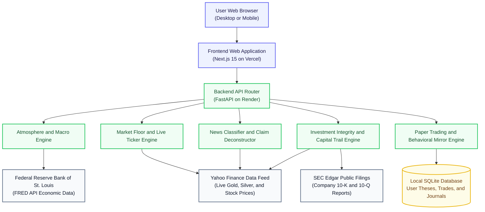

# Lucid Observatory and Investment Integrity Engine

A calm, transparent financial web application built to help everyday people understand the market, verify news claims, practice investing without losing real money, and trace where their investment dollars actually go.

# Live Demo Links

Add your live website links in this section after completing your free deployment:

* Live Web Application: https://lucid-observatory.vercel.app (Paste your Vercel link here)

# What is Lucid?

Most investing apps today are designed like video games or digital casinos. They use flashing red and green lights, push notifications that cause panic, and complicated financial jargon that confuses normal people. At the same time, social media is full of fake financial advice and exaggerated headlines.

Lucid was built to fix this problem. It is an educational observatory where you can:

1. Understand the market mood before looking at any stock prices.
2. Read real news where sensational headlines are separated from the actual facts.
3. Test investment claims and practice trading with virtual money so you never risk your life savings.
4. Screen companies for ethical standards and see exactly which subsidiaries and business lines your money touches.
5. Discover your own psychological habits and emotional biases so you make calm decisions.

# Quick Glimpse of How the Project Works

Here is the simple step by step journey of a user inside Lucid:

Step 1: The Observatory Atmosphere
When you open Lucid, you see the market atmosphere score from 0 to 100. This tells you if the overall economy is fearful, calm, or overheated using data from the Federal Reserve.

Step 2: Concept Studios
You can open visual studios that show you how money works in real life. For example, you can use interactive sliders to see how inflation eats away at cash savings compared to gold over 10, 20, or 30 years.

Step 3: The Market Floor and the News Broadsheet
You can watch a live ticker tape with real prices for Gold, Silver, Platinum, major stock indices, and tech stocks. Below the charts, our smart news reader pulls real articles and scores them on factual substance versus clickbait hype. It clearly tells you what the news actually means in plain words.

Step 4: The Investment Integrity Engine and the Capital Trail
Type in any company like Apple, Microsoft, Nvidia, or Tesla. The system checks if the company follows ethical and Shariah financial rules (such as AAOIFI, DJIM, FTSE, and MSCI). It opens the Capital Trail, which shows you your investment dollar traveling from the parent company into its subsidiaries, its debt levels, and its dividend purification calculation.

Step 5: Practice Arena and Claim Deconstruction
If you see someone on social media claiming a stock will double next week, you can paste the text into Lucid. Lucid breaks down the claim, scores the hype level, and lets you write down your reasoning before placing a simulated paper trade.

Step 6: Behavioral Mirror
The application remembers your past simulated decisions and helps you spot emotional habits, such as buying out of FOMO or holding onto losing trades for too long.

# Tech Spec Passport

Here is the complete list of technologies used to build both the frontend and backend of this project:

## Frontend Stack

* Framework: Next.js version 15 with App Router
* UI Library: React version 19
* Language: TypeScript
* Styling: Tailwind CSS with custom editorial themes
* Icons: Lucide React (clean professional icons, zero emojis)
* Data Fetching and Caching: TanStack React Query version 5
* Interactive Canvas: HTML5 Canvas for the welcome constellation animation
* Responsive Layout: Works on desktop monitors, laptops, tablets, and phones

## Backend Stack

* Web Framework: FastAPI (Python 3.12)
* Application Server: Uvicorn ASGI server
* Data Validation: Pydantic version 2
* Database: SQLite with async support (aiosqlite and SQLAlchemy 2.0)
* Machine Learning and Text Processing: Scikit-learn, NumPy, and Pandas
* News Analysis: TF-IDF vector text processing and Naive Bayes classification
* Live Market Data: Yahoo Finance (yfinance library) for real stock and commodity prices
* Economic Data: Federal Reserve Bank of St. Louis FRED API for Treasury yields and economic indicators
* Automated Tests: Pytest with 27 automated tests covering all modules

# System Design Architecture

Below is a simple visual diagram showing how the frontend, backend, database, and real data sources connect together:



# How to Run the Project Locally

If you want to run this project on your own computer:

## 1. Run the Backend

Open a terminal in the backend folder:

```bash
cd backend
python -m venv venv
```

Activate the virtual environment:
* On Windows: venv\Scripts\activate
* On Mac or Linux: source venv/bin/activate

Install the requirements and start the server:

```bash
pip install -r requirements.txt
python -m uvicorn app.main:app --port 8000 --reload
```

The backend will start at http://127.0.0.1:8000. You can view the live interactive API documentation at http://127.0.0.1:8000/docs.

## 2. Run the Frontend

Open a second terminal in the frontend folder:

```bash
cd frontend
npm install
npm run dev
```

The frontend website will open at http://localhost:3000.

## 3. Run the Automated Tests

To verify that all 27 automated tests pass:

```bash
cd backend
python -m pytest
```

# Mandatory Legal Notices and Attribution

## Federal Reserve Bank of St. Louis Notice
This product uses the FRED API but is not endorsed or certified by the Federal Reserve Bank of St. Louis.

## Export and Compliance Notice
This software complies with all United States export laws and Office of Foreign Assets Control (OFAC) regulations. By using this software, you confirm you are not located in any embargoed destination.

## Educational Disclaimer
Lucid is created solely for educational, research, and self-reflection purposes. It does not provide personalized investment advice, tax advice, or legal advice. Simulated paper trading does not involve real money.

# License

This project is licensed under the open source MIT License. You are free to use, modify, and distribute this software for educational and personal projects.
