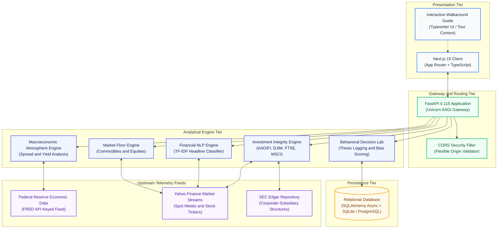

# Lucid Financial Observatory and Investment Integrity Platform

An open-source financial diagnostic observatory, macroeconomic intelligence platform, and investment integrity engine. Lucid provides verified market telemetry, algorithmic news deconstruction, multi-standard ethical capital screening, and behavioral simulation tools for research and financial education.

---

## Deployment and Live Service Endpoints

| Resource | Environment | URL / Endpoint |
| :--- | :--- | :--- |
| Web Application | Production (Vercel) | [https://lucid-observatory.vercel.app](https://lucid-observatory.vercel.app) |
---

## Table of Contents

1. [Executive Summary](#executive-summary)
2. [Platform Architecture and Core Engines](#platform-architecture-and-core-engines)
3. [Technical Specification Passport](#technical-specification-passport)
4. [System Design and Data Flow Architecture](#system-design-and-data-flow-architecture)
5. [REST API Service Directory](#rest-api-service-directory)
6. [Local Development and Setup](#local-development-and-setup)
7. [Automated Verification and Testing](#automated-verification-and-testing)
8. [Regulatory Notices and Compliance Disclaimers](#regulatory-notices-and-compliance-disclaimers)
9. [Licensing](#licensing)

---

## Executive Summary

Lucid is designed as an analytical counterweight to speculative volatility and information asymmetry in modern capital markets. Rather than prioritizing trade frequency, Lucid decouples market analysis into structured diagnostic layers:

* **Macroeconomic Atmosphere Diagnostics**: Synthesizes yield curve dynamics, Federal Reserve policy metrics, and liquidity spreads into a normalized market health index.
* **Algorithmic News Deconstruction**: Parses financial headlines using natural language processing to isolate quantitative facts from speculative rhetoric.
* **Investment Integrity Engine**: Evaluates parent-subsidiary corporate relationships against international ethical and Shariah financial criteria (AAOIFI, DJIM, FTSE, and MSCI).
* **Capital Trail Visualization**: Maps the flow of investment capital across supply chains, operational subsidiaries, debt structures, and dividend purification requirements.
* **Behavioral Execution Arena**: Provides simulated trade execution linked to mandatory pre-decision theses, enabling objective tracking of cognitive biases (e.g., loss aversion, disposition effect).

---

## Platform Architecture and Core Engines

### 1. Macroeconomic Atmosphere Engine
Aggregates live sovereign debt yields and liquidity benchmarks directly from the Federal Reserve Bank of St. Louis (FRED® API):
* **Yield Curve Inversion Spread**: 10-Year Treasury Constant Maturity minus 2-Year Treasury Constant Maturity (T10Y2Y).
* **Liquidity and Credit Stress**: BofA Merrill Lynch US High Yield Option-Adjusted Spread and Federal Funds Effective Rate.
* **Normalized Sentiment Score**: Scaled from 0 (extreme systemic panic) to 100 (frothy exuberance), establishing macro context prior to individual asset inspection.

### 2. Market Floor and Commodities Telemetry
Monitors real-time multi-asset price action across spot commodities and global benchmark equities:
* **Precious Metals**: Gold (XAU/USD via GC=F), Silver (XAG/USD via SI=F), and Platinum (PL=F).
* **Indices and Equities**: S&P 500 ETF (SPY), Nasdaq 100 (QQQ), and foundational technology equities.
* **Historical Windows**: Dynamic multi-timeframe charting spanning 7-day, 30-day, 90-day, 1-year, and 5-year horizons with moving average overlays.

### 3. Financial NLP and BroadSheet Engine
Analyzes media discourse using text processing and lexical analysis pipelines:
* **Substance vs. Sensationalism Classification**: TF-IDF vectorization paired with multinomial classification to score clickbait probability.
* **Headline Decomposition**: Extracts mentioned ticker entities, identifies primary catalysts, and generates concise editorial summaries in plain language.
* **Claim Deconstruction Matrix**: Accepts arbitrary social media posts or news claims to score factual backing, source attribution, and promotional bias.

### 4. Investment Integrity and Capital Trail Engine
Performs structural compliance evaluation across international governance frameworks:
* **Hierarchical Screening**: Inspects parent entities, operating subsidiaries, and business segments to calculate restricted revenue exposure (e.g., conventional interest, alcohol, gambling, weapons).
* **Financial Ratio Auditing**:
  * Debt-to-Market Capitalization (Threshold: < 33%)
  * Cash and Interest-Bearing Securities to Market Capitalization (Threshold: < 33%)
  * Accounts Receivable to Total Assets (Threshold: < 49% or < 33% depending on standard)
* **Capital Trail Graph**: Visualizes parent-to-subsidiary cash routing, revealing indirect non-compliant revenue streams.
* **Purification Calculator**: Quantifies the exact non-permissible dividend percentage required for charitable deduction.

### 5. Behavioral Practice Companion
A risk-free paper trading and decision evaluation lab:
* **Pre-Trade Thesis Mandatory Gate**: Requires users to articulate a hypothesis, conviction level, and emotional state prior to order placement.
* **Behavioral Mirror**: Analyzes transaction logs over time to detect psychological pitfalls, including overconfidence, panic selling, and confirmation bias.

---

## Technical Specification Passport

### Frontend Architecture

| Parameter | Specification | Purpose |
| :--- | :--- | :--- |
| Framework | Next.js 15.2.0 (App Router) | Server-side rendering, route grouping, static generation |
| Runtime / UI | React 19.0.0 | Concurrent rendering and reactive component tree |
| Language | TypeScript 5.8 | End-to-end type safety and interface validation |
| Styling Architecture | Tailwind CSS 3.4 | Responsive layouts and design system |
| Iconography | Lucide React | Standardized technical iconography |
| Data Caching | TanStack React Query 5.66 | Client-side caching, polling, and optimistic updates |
| Visual Canvas | HTML5 2D Canvas API | Real-time particle and constellation graph rendering |
| Target Devices | Responsive Web | Desktop, laptop, tablet, and mobile browsers |

### Backend Architecture

| Parameter | Specification | Purpose |
| :--- | :--- | :--- |
| Web Framework | FastAPI 0.115 | High-performance asynchronous RESTful API |
| ASGI Web Server | Uvicorn 0.34 | Asynchronous server gateway interface |
| Runtime | Python 3.12 | Base execution environment |
| Settings Management | Pydantic v2 Settings | Strict environment parsing with custom array validators |
| Object Relational Mapping | SQLAlchemy 2.0 (Async) | Non-blocking database session management |
| Primary Database | SQLite via aiosqlite | Lightweight, self-contained relational persistence |
| Production Database | PostgreSQL / Supabase ready | Configurable via DATABASE_URL connection string |
| Machine Learning | Scikit-learn, NumPy, Pandas | TF-IDF text feature extraction and sentiment scoring |
| Automated Testing | Pytest with pytest-asyncio | 27 unit, integration, and endpoint test routines |

### External Data Ingestion Pipelines

| Provider | Data Protocol | Data Ingested |
| :--- | :--- | :--- |
| Federal Reserve (FRED®) | HTTPS REST API | Macroeconomic interest rate spreads, Treasury yields |
| Yahoo Finance (yfinance) | Asynchronous Data Streams | Spot commodities, ETFs, historical candles, equities |
| SEC EDGAR | Public Document Filings | Corporate parent-subsidiary structures and 10-K notes |

---

## System Design and Data Flow Architecture



---

## REST API Service Directory

The backend exposes a structured RESTful API versioned under `/api/v1`. Interactive documentation is generated at `/docs`.

| Method | Endpoint Route | Description |
| :--- | :--- | :--- |
| `GET` | `/health` | Service operational health and status check |
| `POST` | `/api/v1/auth/register` | Register a new user profile with hashed credentials |
| `POST` | `/api/v1/auth/token` | Obtain JWT access token for authenticated operations |
| `GET` | `/api/v1/sentiment/atmosphere` | Returns 0-100 macroeconomic sentiment index |
| `GET` | `/api/v1/commodities/gold` | Real-time spot Gold pricing and 24-hour delta |
| `GET` | `/api/v1/commodities/all` | Live prices for Gold, Silver, Platinum, and Palladium |
| `GET` | `/api/v1/market-floor/commodities` | Broad commodity basket data with daily metrics |
| `GET` | `/api/v1/market-floor/stocks` | Watchlist stock performance and percentage changes |
| `GET` | `/api/v1/market-floor/history` | Historical candlestick data for specified symbols |
| `GET` | `/api/v1/news/broadsheet` | Parsed financial broadsheet with hype vs. fact scores |
| `POST` | `/api/v1/claims/analyze` | Evaluates public claims for veracity and emotional bias |
| `POST` | `/api/v1/integrity/screen` | Multi-standard ethical and financial compliance screening |
| `GET` | `/api/v1/integrity/capital-trail/{symbol}` | Subsidiary hierarchy, debt breakdown, and purification |
| `POST` | `/api/v1/portfolio/trade` | Executes simulated paper trade with thesis validation |
| `GET` | `/api/v1/portfolio/summary` | Retrieves virtual portfolio holdings and cash balance |
| `POST` | `/api/v1/decisions/log` | Records trade rationale and pre-decision emotional state |
| `GET` | `/api/v1/insights/behavioral-mirror` | Returns cognitive bias evaluation across past trades |

---

## Local Development and Setup

### Prerequisites
* Python 3.12 or higher
* Node.js 18.18 or higher (LTS recommended)
* Git

### 1. Backend Service Configuration

Navigate to the `backend` directory and configure the Python virtual environment:

```bash
cd backend
python -m venv venv
```

Activate the environment:
* Windows PowerShell: `.\venv\Scripts\Activate.ps1`
* macOS / Linux: `source venv/bin/activate`

Install project dependencies:

```bash
pip install -r requirements.txt
```

Launch the Uvicorn development server:

```bash
uvicorn app.main:app --host 127.0.0.1 --port 8000 --reload
```

The API service will initialize at `http://127.0.0.1:8000`. Swagger documentation is accessible at `http://127.0.0.1:8000/docs`.

### 2. Frontend Application Configuration

In a separate terminal, navigate to the `frontend` directory:

```bash
cd frontend
npm install
```

Start the Next.js development server:

```bash
npm run dev
```

The web application will open at `http://localhost:3000`.

---

## Automated Verification and Testing

The backend includes a comprehensive automated test suite testing all endpoints, data engines, NLP classifiers, and database interactions.

Run the test suite with Pytest:

```bash
cd backend
python -m pytest -v
```

### Test Suite Execution Summary
* **Total Tests**: 27 unit and integration tests
* **Execution Status**: 27 passing (100% pass rate)
* **Coverage Scope**: Auth routes, atmosphere generator, commodity streams, NLP claim deconstruction, integrity screening, and portfolio ledger.

---

## Regulatory Notices and Compliance Disclaimers

### Federal Reserve Bank of St. Louis Notice
This product utilizes the Federal Reserve Bank of St. Louis (FRED®) API but is not endorsed, certified, or sponsored by the Federal Reserve Bank of St. Louis. FRED® is a registered trademark of the Federal Reserve Bank of St. Louis.

### Export Administration and OFAC Compliance
This software complies with United States export administration laws and the economic sanctions administered by the U.S. Department of the Treasury's Office of Foreign Assets Control (OFAC). Access to this platform is restricted in jurisdictions subject to comprehensive U.S. sanctions.

### Educational Research Disclaimer
The Lucid platform, including all analytical models, market atmosphere indices, claim deconstructions, and integrity calculations, is created exclusively for educational, scholarly, and non-commercial research purposes. Nothing within this software constitutes personalized investment, legal, accounting, or tax advice. Simulated paper trading utilizes virtual credits and carries no capital risk.

---

## Licensing

This project is licensed under the open-source **MIT License**. You are free to inspect, adapt, and build upon this software for educational, academic, and non-commercial applications. See the `LICENSE` file in the project repository for full legal text.
